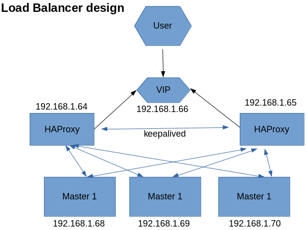

## Load Balancer setup

We will be setting up two node haproxy for load balancer solution. In order to avoid single point failure we will us keep alived as a vip solution. Hence this will be a HAProxy cluster.

The design will be something like bellow.



1. check the selinux status 

```bash  
# getenforce ```

disable selinux

```bash 
#sed -i 's/^SELINUX=enforcing$/SELINUX=permissive/' /etc/selinux/config ```

2. Check firewall status

disable firewalld  or configure for port 6443 (api port of kubernetes)

i am disabling it.
```bash 
#systemctl disable firewalld ```

3. install and setup components on both lb1 and lb2 node

```bash 
#yum install haproxy keepalived -y
#cd /etc/keepalived
#mv keepalived.conf  keepalived.conf-orig
#vim /etc/keepalived/keepalived.conf
```

bellow content you can keep in LB1 node keepalived .conf file.
```bash
vrrp_script haproxy-check {
    script "killall -0 haproxy"
    interval 2
    weight 20
}
 
vrrp_instance haproxy-vip {
    state MASTER
    priority 101
    interface eth0
    virtual_router_id 47
    advert_int 3
 
    unicast_src_ip 192.168.1.64
    unicast_peer {
        192.168.1.65
    }
 
    virtual_ipaddress {
        192.168.1.66
    }
 
    track_script {
        haproxy-check weight 20
    }
}
```
bellow content you can keep in LB2 node keepalived .conf file.
```bash
vrrp_script haproxy-check {
    script "killall -0 haproxy"
    interval 2
    weight 20
}
 
vrrp_instance haproxy-vip {
    state BACKUP
    priority 101
    interface eth0
    virtual_router_id 47
    advert_int 3
 
    unicast_src_ip 192.168.1.65
    unicast_peer {
        192.168.1.64
    }
 
    virtual_ipaddress {
        192.168.1.66
    }
 
    track_script {
        haproxy-check weight 20
    }
}
```

now to configure HAProxy on both the nodes with same configuration.

```bash
# cd /etc/haproxy
# mv haproxy.cfg  haproxy.cfg-orig
# vim haproxy.cfg
```
keep bellow configuration in file.

```bash
global
  log /dev/log  local0
  log /dev/log  local1 notice
   chroot      /var/lib/haproxy
    pidfile     /var/run/haproxy.pid
    maxconn     4000
    user        haproxy
    group       haproxy
    daemon
  ca-base /etc/ssl/certs
  crt-base /etc/ssl/private
  ssl-default-bind-ciphers ECDH+AESGCM:DH+AESGCM:ECDH+AES256:DH+AES256:ECDH+AES128:DH+AES:RSA+AESGCM:RSA+AES:!aNULL:!MD5:!DSS
  ssl-default-bind-options no-sslv3

defaults
  log global
  mode  http
  option  httplog
  option  dontlognull
  timeout connect 5000
  timeout client  50000
  timeout server  50000
  timeout http-request 15s
  timeout http-keep-alive 15s
  errorfile 400 /etc/haproxy/errors/400.http
  errorfile 403 /etc/haproxy/errors/403.http
  errorfile 408 /etc/haproxy/errors/408.http
  errorfile 500 /etc/haproxy/errors/500.http
  errorfile 502 /etc/haproxy/errors/502.http
  errorfile 503 /etc/haproxy/errors/503.http
  errorfile 504 /etc/haproxy/errors/504.http

frontend monitor-in
  bind *:33305
  mode http
  option httplog
  monitor-uri /monitor

listen stats
  bind    *:9000
  mode    http
  stats   enable
  stats   hide-version
  stats   uri       /stats
  stats   refresh   30s
  stats   realm     Haproxy\ Statistics
  stats   auth      Admin:Password

frontend k8s-api
  bind *:6443
  mode tcp
  option tcplog
  default_backend k8s-api

backend k8s-api
  mode tcp
  option tcplog
  option tcp-check
  balance roundrobin
  default-server inter 10s downinter 5s rise 2 fall 2 slowstart 60s maxconn 250 maxqueue 256 weight 100
  server kctl1.mylab.local 192.168.1.68:6443 check
  server kctl2.mylab.local 192.168.1.69:6443 check
  server kctl3.mylab.local 192.168.1.70:6443 check
  server kctl3.mylab.local 192.168.1.70:6443 check
```
now restart and enable services on both the nodes 

```bash
# systemctl enable haproxy && systemctl start haproxy
# systemctl enable keepalived && systemctl start keepalived

```
Done!

example configuration files given in [dir](conf) 


[Read me](README.md)
